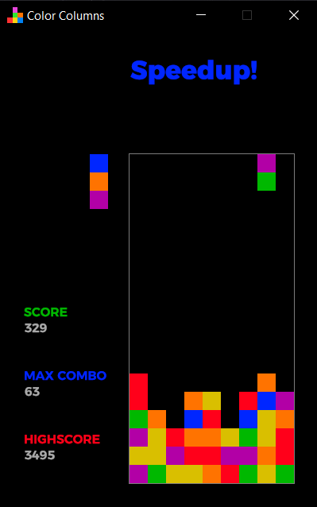

# Color Columns
A falling-blocks-type 2D game with a simple but addictive gameplay

## About
The game is a remake of various old, "classic", columns-type games.
And it's made in an attempt to learn [Rust programming language](https://www.rust-lang.org/).

Game-dev framework used is [ggez](https://ggez.rs/).

## Download
At the moment, only Windows version is available, and it is [freely downloadable as a .zip file](https://github.com/rdrmic/color-columns/raw/main/dist/color-columns-v015.zip) that contains a standalone / portable / no-installer .exe file.

However, prerequisite is Microsoft C++ runtime, which can be downloaded [here](https://docs.microsoft.com/en-us/cpp/windows/latest-supported-vc-redist?view=msvc-170#visual-studio-2015-2017-2019-and-2022), in case you don't have it on your machine already.
